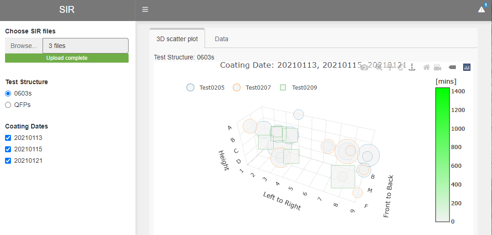
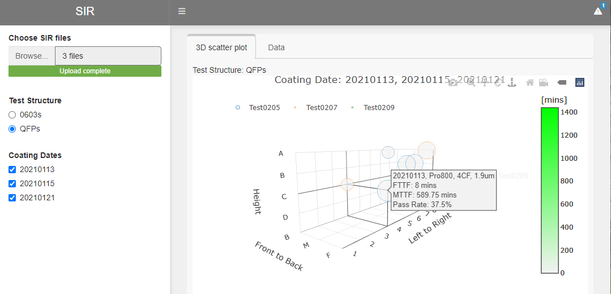
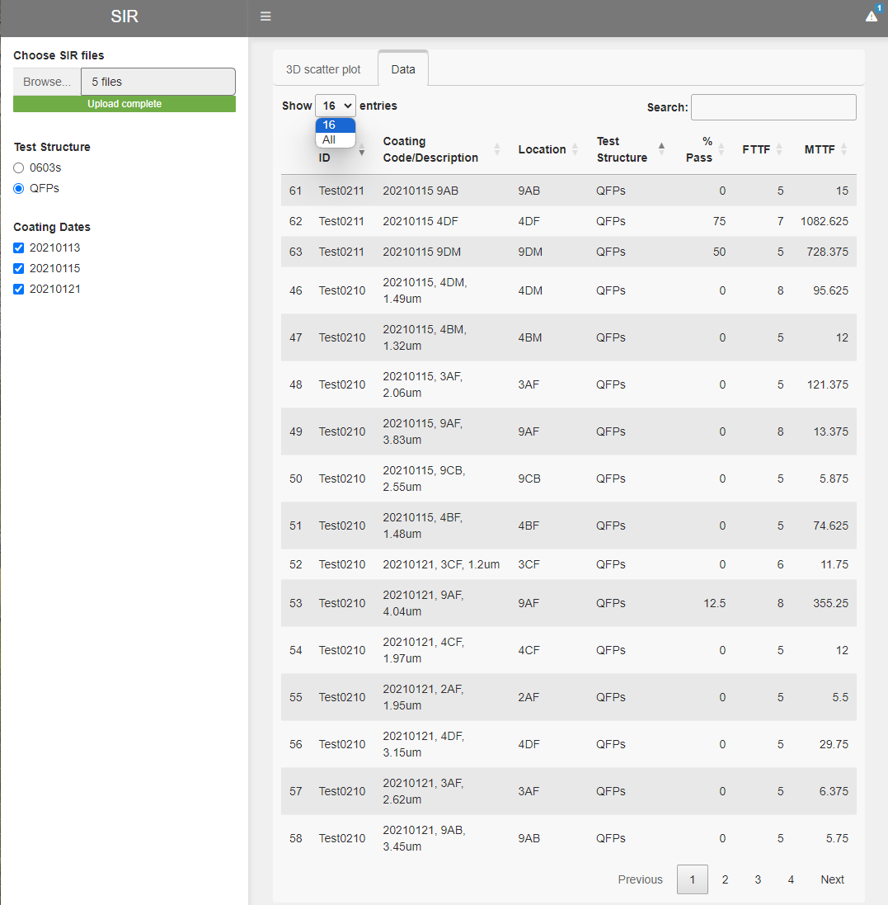

# 3D Scatter Plot Dashboard

Create an interactive 3D scatter plot to visualize process uniformity inside a deposition chamber.

Key features:

- Shiny Dashboards with Sidebar and Dynamic Tabs
- Data Extraction and Transformation
- EDA
- Interactive 3D Scatter Plot
- Data Frame Download

R packages used:

- `here`: enables easy file referencing and builds file paths in a OS-independent way
- `stats`: loads this before loading `tidyverse` to avoid masking some `tidyverse` functions
- `tidyverse`: includes collections of useful packages like `dplyr` (data manipulation), `tidyr` (tidying data),  `ggplots` (creating graphs), etc.
- `rlang`: collection of frameworks and APIs for programming with R including non-standard evaluation
- `readxl`: read excel files
- `lubridate`: handle date and datetime data type
- `hms`: functions to deal with time
- `shiny`: build interactive web applications
- `shinydashboard`: provides a theme on top of 'Shiny', making it easy to create attractive dashboards
- `dashboardthemes`: allows manual creation of themes and logos to be used in applications created using the 'shinydashboard' package
- `DT`: a wrapper of the JavaScript Library 'DataTables'
- `plotly`: makes interactive, publication-quality graphs

## Workflow

- Setup: configure options, load packages and define helper functions
- Load one or multiple process data files
- Plot interactive 3D scatter plot

Files and directories:

- `00 preloads.R`: set up and load packages
- `01 HZO SIR.R`: include helper functions to process and plot process log data
- `11d read SIR summary.R`: includes helper functions to read and summarize data
- `/data`: raw data files for demo
- `/screenshots`: screenshots of the app
- `/HZO_SIR`: Shiny app

## App Demo

For a demo, run the Shiny app from Github repo with the codes below:

```{r}
shiny::runGitHub("3D_Scatter_Plot_Dashboard", "chsueh2", subdir = "HZO_SIR/") 
```

## Screenshots

### Interative 3D Scatter Plot


### Interative 3D Scatter Plot with Label


### Data Extraction and Download
